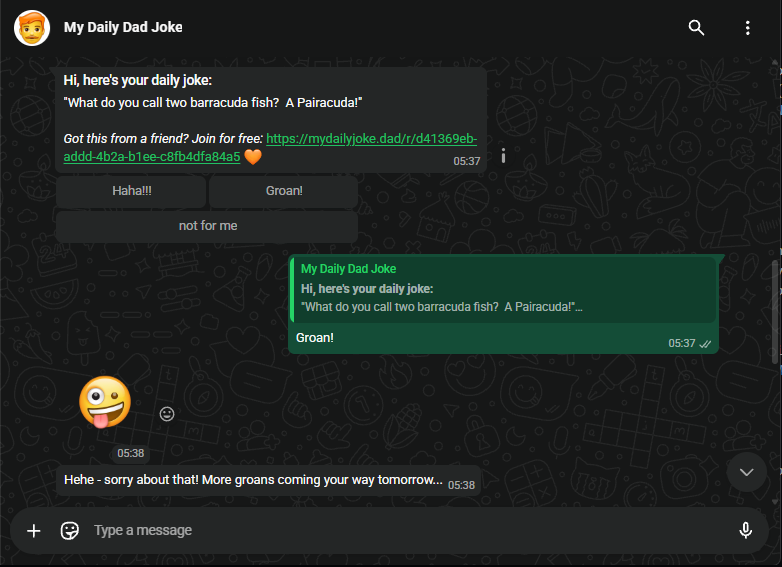

# 👋 Hi, I'm Jonathan

## My approach

I specialize in building products that feel really intuitive to use, but are actually very powerful underneath. On the surface that sounds like a contradiction, but I've found that they both come down to the same thing: carefully thinking things through and organizing everything in a logical way.

## Startup Experience

I started out in the industry about 12 years ago, mostly working freelance. My first major role was just over 10 years ago at a Machine Learning startup called "Intuview". My main responsibility was taking full ownership of the Frontend, but I also got to do some Backend work on the side.

Because I wanted to have as much impact as possible, I slowly worked my way up to bigger and bigger companies until I finally joined Microsoft 5 years ago.

## Microsoft

At Microsoft, I worked on the Azure Portal Frontend team, building the ADP platform for refining Machine Learning models. I also took responsibility for Accessibility compliance for my whole engineering group. But this wasn't just about fixing all the bugs myself. It was more about shifting everyone's mindset from viewing Accessibility as an inconvenient legal hurdle to an opportunity to create the best possible experience for all our users!

## Machine Learning Research

After 4 years at Microsoft, as our project started winding down, I took the opportunity to pivot and dive deeper into areas I'd always been interested in but never had the time to explore in depth - including Backend, AI, and Machine Learning. My main focus has been [training an AI to have a sense of humour](#my-daily-dad-joke---ml-research) - which sounds like a bit of a joke, but is actually one of the trickiest unsolved problems in machine learning.

Now that I've learned how to use AI to work more productively - and even built my own [open source productivity tools](#ensemble---agentic-workflow-for-vs-code) - I'm really excited to bring all of that back into the industry.

## What am I looking for now?

I'm looking for Frontend and Fullstack roles on product teams where I can have end-to-end ownership and really meaningful impact.

---

## My Specialties

| Technology | Experience |
| :--------- | :--------- |
| HTML       | 12 years   |
| CSS        | 12 years   |
| JavaScript | 12 years   |
| TypeScript | 8 years    |
| React      | 8 years    |

---

## Recent Focus

| Category | Technology |
| :------- | :--------- |
| Backend | Node.js |
| REST APIs | Hono |
| Message Queues | SQS |
| Database | PostgreSQL |
| Vector Search | pgvector |
| Machine Learning | Model Training |
| AI Platform | Bedrock |
| Cloud | AWS |
| Serverless | Lambda |
| Caching | Redis |
| Browser Extensions | Chrome |
| IDE Extensions | VS Code |
| Workspace Add-ons | Google Workspace |

---

# Highlights

## Ensemble - Agentic Workflow for VS Code

An agentic workflow system for VS Code that turns an idea into a supervised, reviewable implementation: capture the task, shape a plan, implement it with the AI provider you choose, and review the result before moving on.

- Source: [j2kenton/vs-code-ai-helper](https://github.com/j2kenton/vs-code-ai-helper)
- Published: [VS Code Marketplace](https://marketplace.visualstudio.com/items?itemName=j2kenton.vs-code-ai-helper)

 

**TypeScript · VSCodeExtension**

 

---

## My Daily Dad Joke - ML Research

A production system that uses AI to generate original jokes and serve them to users via WhatsApp. The jokes get better and better based on the feedback of each user. The long-term goal is to train a foundational model that is not just smart but also hilarious!

- More info: [mydailyjoke.dad](https://mydailyjoke.dad/)
- Try it for free: [mydailyjoke.dad/join](https://mydailyjoke.dad/join)

 

**MachineLearning · LLM · VectorEmbeddings · AmazonBedrock · TypeScript · NodeJS · PostgreSQL · AWS · SQS · Lambda**

 

---

## Algo Coach - AI DSA Coach

A Chrome extension that acts as an AI coach for LeetCode, helping you learn how to solve problems instead of just handing you the answer. It progressively reveals help - from pattern recognition and tradeoffs to hints, pseudocode, and code - plus an Interviewer mode for rehearsing technical interviews, backed by a library of reusable JavaScript DSA templates.

- Source: [j2kenton/dsa](https://github.com/j2kenton/dsa)
- Published: [Chrome Web Store](https://chromewebstore.google.com/detail/dsa-templates/ollnhakcihdpbakabcdgagaciipklehd)

 

**JavaScript · ChromeExtension · OpenAI · AI**

 

---

## Career Connect

A Chrome extension for LinkedIn networking and job hunting. Search for people by company, title, and location, and send personalized connection invites at a paced rate. It also has AI tools that use a LinkedIn profile, your CV, and a job description to research a company and generate interview prep.

- Source: [j2kenton/linkedin-linker](https://github.com/j2kenton/linkedin-linker)
- Published: [Chrome Web Store](https://chromewebstore.google.com/detail/linkedin-connection-assis/poedmlfffaldgihhpffkbknjegmkpclj)

 

**TypeScript · ChromeExtension · AnthropicAPI · OpenAI · AI**

 

---

## Gem3 - AI Chatbot

A free chatbot powered by the latest version of Gemini Flash. No subscription required, just log in with your existing Microsoft account and start chatting.

- Source: [j2kenton/revamp-1](https://github.com/j2kenton/revamp-1)
- Live: [www.gem3.app](https://gem3.app/)

 

**TypeScript · React · NextJS · NodeJS · Redis · SSE · GeminiAPI · Azure · Redux · TailwindCSS**

 

---

## Gmail Plugin: Send to Calendar

A Google Workspace add-on that makes it easy to turn emails into calendar events - just open a message in Gmail, hit the button, and it uses AI to read the details and add the event straight to your Google Calendar. No copy-pasting, no switching tabs.

- Source: [j2kenton/gmail-to-calendar](https://github.com/j2kenton/gmail-to-calendar)
- Status: Pending Google Workspace Marketplace review

 

**GoogleAppsScript · GeminiAPI · GoogleWorkspace**

 

